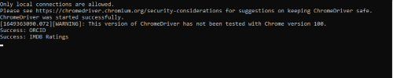
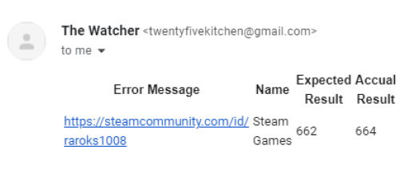

# The Watcher

*C# Console Application for Watching changes on Websites made using Selenium.*


## Application Design

### *Console View*


View of the console while the application is running.

### *Email View*


Email notification of errors.

## Other remarks

### Files

- You only need to add the **watcher.json** file in the *bin/Debug* folder
- **watcher.json** file should be made according to the example given bellow:
```
{
	"Urls": [
		{
			"Title": "Title",
			"Url": "https://someurl.com",
			"Value": "Value1",
			"XPath": "FullXPath"
		}
	],
	"CheckDuration": 3600000,
	"ToEmail" : "email@email.com",
	"Email": "email@email.com",
	"Password": "Pass123"
}
```
- properties in the json file are:
  - *CheckDuration* - time in milliseconds for when to run the next set of checks. (3600000=1hour)
  - *ToEmail* - email on which to send notification.
  - *Email* and *Password* - email and password for an email from which the notification will be sent.
  - *Urls* - array of urls to check.
  - *Title* - title of your url to check.
  - *Url* - url to navigate to.
  - *Value* - value expected to get on the element.
  - *XPath* - FullXPath of the element to check.
